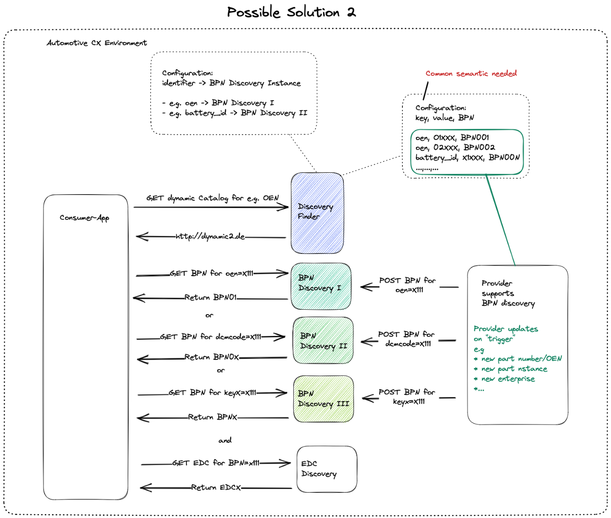

## 2 Architecture and constraints

### Overall Architecture

A consumer sends a request to the Discovery Finder with a catalogue of a certain types e.g., "bpid", "oen". The Discovery Finder 
responses with a list of endpoints of BPN Discoveries which provide BPNs for these kind of types.  
Subsequently the consumer sends a request to the given BPN Discoveries. If the BPN Discovery finds a matching entries he returns a List of BPNs. 
With the given BPN the consumer can search for EDCs at the EDC Discovery according to this BPN.

### Overall-View

### Architecture
A consumer can send a request to the Discovery Finder with a catalogue of different types. The Discovery Finder then will send a list of endpoint of
BPN Discoveries which are providing BPNs for the requested types. 

### Constraints

-   Every Provider handles its own EDC / Digital Twin Registry - this
    is no central service.

-   Consumer and Data Provider must have a technical user with correct user-roles

-   The Discovery Finder is a central component and must be managed by
    one instance.

### Architecture Constraints

-   Developed under an open-source license and all used frameworks and
    libraries suites to this license.

-   Must be compliant and fulfill the Catena-X Guidelines.

-   The deployment is done in a Catena-X environment. So, the Discovery Finder must be able to run in a Kubernetes environment with Helm
    Charts.

-   The Discovery Finder must be managed centralized.

-   Keycloak as an OAuth2 compliant authorization is needed to manage the identity of and access of the user.